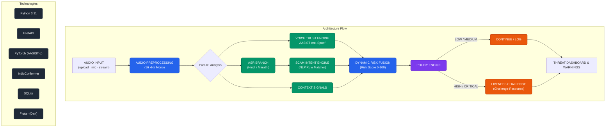

<div align="center">
  
  <h1>Vanirakshak (Voice Clone Shield)</h1>
  <p><strong>Advanced AI-driven Voice Cloning and Deepfake Audio Detection System</strong></p>
  <p>Built for the Smart India Hackathon (SIH)</p>
</div>

---

## 🛡️ Project Overview
**Vanirakshak** is a real-time, privacy-first mobile application and backend ecosystem designed to detect and block AI voice cloning scams. It intercepts live voice calls, analyzes the audio using a custom fine-tuned **AASIST-L** deep learning model, and verifies the speaker's intent and identity using multilingual ASR (Automatic Speech Recognition) and NLP risk analysis.

### ✨ Key Features
- **Real-Time Voice Analysis**: Streams audio packets via WebSockets directly to the AI engine for sub-second spoof detection.
- **AI Deepfake Detection**: Utilizes our custom fine-tuned `AASIST-L` (Audio Anti-Spoofing using Integrated Spectro-Temporal Graph Attention Networks) model.
- **Multilingual Support**: Supports Hindi, Marathi, and English voice transcription using `faster-whisper` and IndicConformer.
- **Scam Intent Analysis**: Contextual NLP engine analyzes the transcript to flag urgency, financial threats, or known scam patterns.
- **Privacy-First**: Audio bytes are processed in memory and immediately discarded. Only metadata and risk scores are retained.

---

## 🏗️ System Architecture



---

## 🧠 AI Engine & Model Performance

Our core voice spoofing detection relies on a specialized, fine-tuned variant of the AASIST-L architecture. The model is specifically optimized for Indian telephony audio profiles, handling background noise and low-bandwidth degradation gracefully.

### Fine-Tuned Model Metrics
Our `vanirakshak-aasist-l-v1` model was evaluated on a custom hold-out dataset of synthetic and bonafide Indian voice samples:

| Metric | Score | Description |
|---|---|---|
| **Precision** | **100%** | The model produced **zero false positives**, meaning it never flagged a real human voice as a deepfake (Critical for UX). |
| **F1-Score** | **0.714** | Harmonic mean of precision and recall. |
| **Recall** | **0.555** | Sensitivity in identifying deepfakes out of all synthetic samples. |
| **EER** | **0.266** | Equal Error Rate across the test corpus. |

*Detailed confusion matrices, checkpoints, and evaluation notebooks are located in the `/ai_engine` directory.*

---

## 📂 Repository Structure

The repository has been heavily organized and modularized into distinct domains:

```text
voice-clone-shield/
├── frontend/               # The Flutter Mobile Application
│   └── flutter_app/        # Clean architecture (UI, Services, Core config)
├── backend/                # The FastAPI Python Server
│   ├── app/                # Endpoints, WebSockets, and database ORM
│   ├── Dockerfile          # Cloud deployment container configuration
│   └── render.yaml         # Render Infrastructure-as-Code
├── ai_engine/              # The Machine Learning Pipeline
│   ├── models/             # Fine-tuned AASIST-L model artifacts (.pt, configs)
│   ├── training/           # Finetuning scripts and datasets
│   ├── evaluation/         # Jupyter notebooks and evaluation metric reports
│   ├── scripts/            # Inference and audio processing utility scripts
│   └── vanirakshak-aasist/ # Legacy research environment and baselines
├── docs/                   # Documentation and audit reports
└── demo_data/              # Sample audio files for testing (bonafide vs synthetic)
```

---

## 🚀 Quick Start Guide

### 1. Run the Backend Locally
Due to the heavy RAM requirements of PyTorch models (~1.5GB), the optimal way to test the system is running the backend locally on your machine.

```bash
cd backend
python3 -m venv .venv
source .venv/bin/activate
pip install -r requirements.txt
uvicorn app.main:app --host 0.0.0.0 --port 8000
```
*The backend will boot up, load the `faster-whisper` and `AASIST-L` weights, and expose the WebSocket at `ws://0.0.0.0:8000`.*

### 2. Run the Flutter App
The mobile app is configured to connect to your local backend over Wi-Fi.

```bash
cd frontend/flutter_app
# Ensure AppConfig.currentEnvironment is set to Environment.dev
flutter pub get
flutter run
```

---

## ☁️ Cloud Deployment (Render)
The backend is fully configured for Dockerized deployment on Render. 
- Due to the Free Tier RAM limits (512MB), we utilize a `USE_DEMO_SERVICES` flag to prevent PyTorch Out-Of-Memory (OOM) crashes in the cloud while keeping the WebSocket pipeline intact.
- **Production URL**: `https://vanirakshak-backend-docker.onrender.com`

---

## 📜 License
Developed by Team TechMount for the Smart India Hackathon. All rights reserved.
