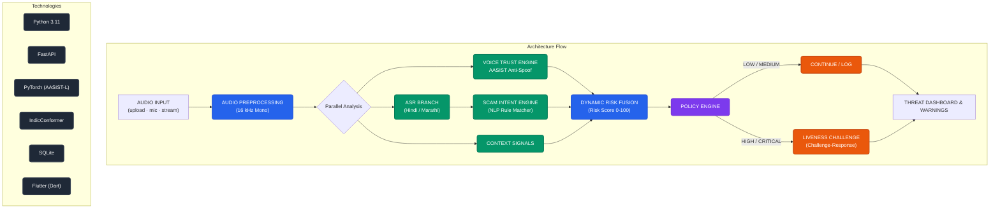

# 🛡️ Vanirakshak — PROTOTYPE

> **PROTOTYPE for an internal Smart India Hackathon round — not a production
> call-security system.** It analyses *recorded / uploaded / microphone* audio
> only; there is no SIM/cellular call interception. Whenever a heavyweight
> model isn't loaded, services return **clearly-labelled demo-mode output**
> ("DEMO MODE — not real inference") instead of crashing (§20).
>
> 📋 **Full implementation plan + roadmap:** see [future.md](future.md)
> (status snapshot, remaining phases 4–14 with acceptance criteria, future
> product roadmap A–L, risk register, judge Q&A).

## Problem

AI voice cloning makes impersonation scams (fake bank officials, police,
relatives) far more convincing. This prototype proves the intelligence
pipeline end-to-end:



## Current status — ALL 18 phases complete ✅

- [x] FastAPI backend: frozen v3 contract, SQLite (privacy-first), health, CORS
- [x] Audio preprocessing: 16 kHz mono pipeline + 1 s chunker (§14)
- [x] **REAL** AASIST-L voice/deepfake detector (loaded once at startup, ~250 ms/clip CPU)
- [x] **REAL** Hindi/Marathi ASR (faster-whisper default; IndicConformer ready but HF-gated)
- [x] **REAL** scam rule engine (14 concepts, hi/mr/en + code-mixed, ASR spelling normalization)
- [x] Attack-type classification · 5-signal risk fusion · per-second Risk(t) timeline · 4-tier policy engine
- [x] Tiered adaptive liveness (expiry, PENDING/PASSED/SUSPICIOUS/FAILED)
- [x] HTTP API: session · analyze/audio (canonical response + risk_timeline) · analyze/message · analyze/url · liveness · history
- [x] WebSocket live-risk streaming (`WS /ws/session/{id}`) + terminal client (`scripts/ws_client.py`)
- [x] Demo fallback system (`app/demo/*`, `USE_DEMO_SERVICES`, `--pure-demo`) — whole pipeline runs with zero models
- [x] Evaluation harness (honest per-sample tables + EER) + fine-tuning learning path (`training/README.md`)
- [x] Trusted-voice enrollment stub (metadata only; embedding model = research track)
- [x] **Phase 13: Flutter dashboard** — Home (live health), Call Analysis (WS
      stream → live Risk(t) chart → full verdict + liveness flow), Message/URL
      scanners, Threat History, Trusted Contacts stub; `flutter analyze` clean,
      `flutter build web` verified
- Full plan: [future.md](future.md) · architecture: [docs/architecture.md](docs/architecture.md) · judge script: [docs/demo_script.md](docs/demo_script.md)

## Run the Flutter dashboard

```bash
# 1) start the backend (from backend/, venv active)
uvicorn app.main:app --host 0.0.0.0 --port 8000

# 2) run the app (from frontend/flutter_app/) — easiest target is Chrome
flutter run -d chrome
# Android emulator works too (backend auto-addressed via 10.0.2.2);
# a real phone: ⚙ in the app → set http://<your-mac-LAN-IP>:8000
```

Home shows live system health; Call Analysis streams the risk timeline one
update per second over WebSocket, then renders the full verdict (voice trust,
transcript, indicators, attack types, liveness flow, source-tagged
explanations, recommendation).

### Android (APK — built & verified on emulator)

```bash
# release APK (JDK 21 for Gradle 8.14 — set once in ~/.gradle/gradle.properties:
#   org.gradle.java.home=/opt/homebrew/opt/openjdk@21/libexec/openjdk.jdk/Contents/Home)
cd frontend/flutter_app && flutter build apk --release
# → build/app/outputs/flutter-apk/app-release.apk (~51 MB universal)

adb install -r build/app/outputs/flutter-apk/app-release.apk
```

Ships with `INTERNET` permission + cleartext HTTP for the LAN prototype
backend (an HTTPS deployment must remove `usesCleartextTraffic`). On the
emulator the app auto-addresses the host at `10.0.2.2:8000`; on a real phone
set the Mac's LAN IP via the in-app ⚙ settings.

## PROTOTYPE vs FUTURE PRODUCT (§27)

| Capability | PROTOTYPE (now) | FUTURE PRODUCT |
|---|---|---|
| Audio source | uploaded WAV / mic file / simulated WS chunks | live WebRTC / SIP telephony stream |
| Deepfake detection | pretrained AASIST-L, evaluated only on prototype clips | fine-tuned + calibrated on Indian-language data (`training/README.md`) |
| ASR | off-the-shelf faster-whisper / IndicConformer | fine-tuned hi/mr + code-mixed, WER-tracked |
| Scam detection | transparent keyword/pattern rules | trained classifier (TF-IDF → transformer) |
| Risk fusion | fixed demo weights 0.30/0.20/0.30/0.10/0.10 | calibrated model on labelled outcomes |
| Identity | enrollment stub; mismatch risk honestly null | speaker embeddings + cross-session trusted memory |
| Liveness | fixed-phrase text match | randomized, replay-resistant, speaker verification |
| Real time | simulated (paced WS updates) | streaming inference, media gateway |
| Infra | one laptop, SQLite, permissive CORS | cloud, Postgres, locked CORS/auth, monitoring |

## Project structure

```
voice-clone-shield/
├── backend/
│   ├── app/
│   │   ├── main.py              # FastAPI entrypoint
│   │   ├── config.py            # .env-driven settings
│   │   ├── api/                 # routers (health now; analyze in Phase 8)
│   │   ├── services/            # VoiceDetector, ASRService, ScamDetector,
│   │   │                        #   LivenessService, AudioProcessor
│   │   ├── risk/                # RiskEngine (weighted fusion, §8)
│   │   ├── models/schemas.py    # §13 API contract
│   │   ├── database/            # SQLite stub (later phase, §17)
│   │   └── utils/               # logging setup
│   ├── tests/                   # smoke tests
│   ├── requirements.txt
│   └── .env.example
├── frontend/flutter_app/        # Phase 10
├── demo_data/                   # Phase 13 test audio/messages
├── scripts/                     # helper scripts
└── docs/                        # architecture/setup/demo docs
```

## Backend setup (macOS, Python 3.11)

```bash
cd backend
python3 -m venv .venv
source .venv/bin/activate
pip install -r requirements.txt
cp .env.example .env          # demo mode is ON by default
```

## Run the server

```bash
# From backend/ with the venv active.
# 0.0.0.0 matters: a phone/emulator on the same Wi-Fi must be able to
# reach the API (§12). Android emulator reaches the host at 10.0.2.2.
uvicorn app.main:app --host 0.0.0.0 --port 8000 --reload
```

## Verify it works

```bash
curl http://127.0.0.1:8000/api/health
```

Expected:

```json
{
  "status": "ok",
  "app": "Voice Clone Shield",
  "version": "0.1.0",
  "demo_mode": true,
  "privacy_mode": true,
  "database": "connected",
  "services": {
    "voice_detector": "loaded",
    "asr_service": "loaded",
    "scam_detector": "stateless",
    "risk_engine": "stateless",
    "liveness_service": "stateless",
    "audio_processor": "stateless",
    "speaker_verifier": "stateless"
  }
}
```

(With zero models downloaded, `voice_detector`/`asr_service` read `demo_mode`
and every analysis is clearly-labelled demo output instead.)

From a phone on the same Wi-Fi (Flutter connectivity check, §12):
`curl http://<your-mac-LAN-IP>:8000/api/health` — find the IP with
`ipconfig getifaddr en0`.

Run the tests: `python -m pytest -v` (from `backend/`).

### Live demo card (works today — §3)

```bash
# from the repo root, with the venv active
python scripts/demo_pipeline.py demo_data/test_babble_16k.wav --lang hi
python scripts/demo_pipeline.py path/to/team_recording.wav --lang mr
```

Prints the full demo card: real AASIST-L deepfake score, demo-mode
transcript/indicators (clearly labelled, §20), the real §8 risk-fusion
formula, a liveness challenge on HIGH risk, and the security warning.
Every signal is tagged REAL vs DEMO-MODE so judges see the honest picture.

### Phase 2 quick check (audio pipeline)

```bash
# from the repo root, with the venv active
python scripts/gen_test_audio.py                             # writes synthetic WAVs to demo_data/
python scripts/check_audio.py demo_data/test_tone_44k_stereo.wav
python scripts/check_audio.py demo_data/test_too_short.wav   # shows the §20 fallback, no crash
```

Expected for the 44.1 kHz stereo file: resampled to 16 kHz mono, ~32000
samples, peak ≈ 1.0 after normalization, 2 one-second chunks. `.m4a` is
deliberately unsupported (needs ffmpeg) — record/convert to WAV.

## Honesty notes (judges will ask — §26)

- **Deepfake model (in use since Phase 3):** pretrained **AASIST-L**
  (anti-spoofing, MIT-licensed, architecture from the official
  [clovaai/aasist](https://github.com/clovaai/aasist) repo; checkpoint from
  `SpeechAntiSpoofingBenchmarks/AASIST-L` on Hugging Face — auto-downloaded,
  or pre-fetch it with `python scripts/download_voice_model.py`).
  Published context for this model family: **~1% EER on ASVspoof2019-LA**
  (its own training benchmark), **12–17% EER on ASVspoof2021**, and **40%+ on
  "in the wild" audio**. It has **never been evaluated on Hindi/Marathi
  speech** — the UI and every analysis response carry this disclaimer.
  Score semantics: `voice_risk = 1 − P(bonafide)`; the 0.5 decision threshold
  is an **uncalibrated prototype cut**.
- **Risk fusion weights (0.30·voice + 0.20·identity + 0.30·scam + 0.10·context + 0.10·liveness):** demo weights only — signals with no evidence are excluded and weights renormalized; exposed as `weights_used` in every response. Not scientifically validated.
- **Liveness (§9):** fixed-phrase text match; it does **not** defeat sophisticated voice cloning.
- The PROTOTYPE-vs-FUTURE-PRODUCT table is above; the full research roadmap (fine-tuning, datasets, MLOps) is in [`training/README.md`](training/README.md) and [`docs/architecture.md`](docs/architecture.md).  .
